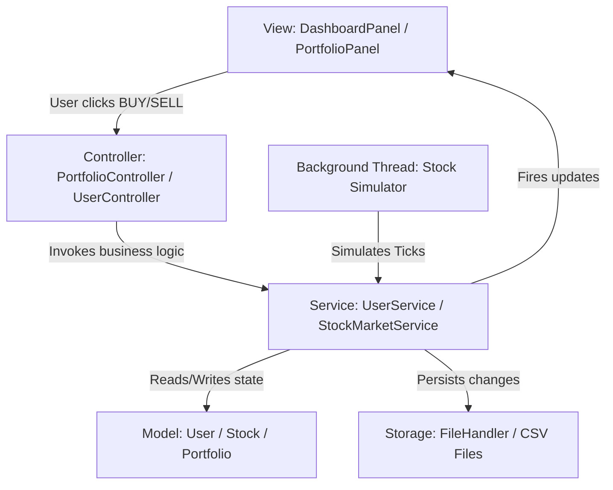

# StonX 📈
### Modern Virtual Stock Market Simulator

StonX is a high-fidelity, real-time Virtual Stock Market Simulator designed to look and feel like a professional modern trading terminal (inspired by Zerodha Kite and Groww). Built entirely in Java 17+ using Swing, FlatLaf (Dark Theme), JFreeChart, and flat-file persistence, it provides a feature-rich trading simulator tailored for academic evaluation.

This project is structured specifically to showcase clean **MVC (Model-View-Controller)** separation, robust **OOP concepts**, and standard **Design Patterns** (Observer, Singleton).

---

## 🚀 Key Features

*   **Authentication & Accounts:** Modern, dark-themed Login and Registration screens with a starting virtual balance of **₹100,000**.
*   **Live Price Engine:** Multi-threaded stock simulator updating prices of 10 top Indian stocks (Reliance, TCS, INFY, HDFC Bank, etc.) every 3 seconds using a random-walk algorithm.
*   **Live Interactive Charting:** Real-time stock trend lines powered by **JFreeChart** that color-code to Green (bullish) or Red (bearish) based on daily returns.
*   **Dynamic Market Mood & Intelligence:** 
    *   **Market Mood Index (MMI):** Real-time Bullish 🐂 vs Bearish 🐻 gauge computed based on advances and declines.
    *   **Live News Bulletins:** Random market news alerts (earnings, regulatory changes, interest rates) that directly influence stock volatility and price trends.
*   **Trading Terminal:** Execute real-time BUY and SELL orders with complete validation (checking funds, quantity holdings).
*   **Portfolio Management:** Live valuation dashboard tracking average buy prices, current value, total investments, and real-time Profit & Loss (P&L) percent.
*   **Watchlist:** Favorite stocks with single-click star toggling to track and trade them directly.
*   **Global Leaderboard:** Ranks all registered accounts based on overall Net Worth (Cash + Live Equity). *Pre-seeded with legendary virtual investors (Rakesh Jhunjhunwala, Radhakishan Damani, Vijay Kedia) for presentation value!*
*   **StonBot AI Assistant:** An offline rule-based chatbot with interactive FAQ chips and natural language text keyword matching for direct investing assistance.
*   **File Database Storage:** Self-healing text-based CSV databases under the `data/` folder, managing user accounts, holdings, transactions, and watchlists.

---

## 🛠️ Setup & Running Instructions

### Prerequisites
*   Java Development Kit (JDK) 17 or higher.
*   Apache Maven installed and added to your system `PATH`.

### Build & Execute Commands
Run the following commands in your terminal (Command Prompt, PowerShell, or bash):

1.  **Clone / Go to Project Directory:**
    ```bash
    cd "c:\Users\TIYASHA SARKAR\OneDrive\Desktop\PROJECTS\StonX"
    ```

2.  **Clean and Compile the Code:**
    ```bash
    mvn clean compile
    ```

3.  **Run the Simulator:**
    ```bash
    mvn exec:java
    ```

### Academic Credentials
*   **Pre-configured Evaluator Profile:**
    *   **Username:** `java_demo`
    *   **Password:** `1234`
    *   *Log in with this account to view an active portfolio and pre-existing watchlist!*

---

## 📐 Object-Oriented Programming (OOP) Explanations

Here is how StonX models core OOP concepts. Feel free to use these explanations during faculty presentation:

### 1. Abstraction
Abstraction hides background complexity and exposes only essential operations.
*   **Implementation:** [Asset.java](src/main/java/com/stonx/model/Asset.java) is an abstract class representing a general financial instrument. It defines the abstract method `getCurrentValue()`. UI and trading panels do not need to know how value is derived for individual asset subclasses; they just invoke the abstract method.
*   **Implementation:** [StockMarketService.java](src/main/java/com/stonx/service/StockMarketService.java) is an interface hiding the background multi-threading, news generation, and math formulas from the views.

### 2. Inheritance
Inheritance allows subclasses to acquire properties and behaviors of a parent class, promoting code reusability.
*   **Implementation:** [Stock.java](src/main/java/com/stonx/model/Stock.java) inherits from [Asset.java](src/main/java/com/stonx/model/Asset.java) (`public class Stock extends Asset`). It inherits the `symbol` and `name` properties and constructors, but expands on them with stock-specific price attributes (`highPrice`, `lowPrice`, `dailyChangePercent`).

### 3. Polymorphism
Polymorphism allows objects to take multiple forms. StonX demonstrates both compile-time and runtime polymorphism.
*   **Runtime Polymorphism (Method Overriding):** `Stock` overrides the abstract method `getCurrentValue()` from `Asset` to return the live market price:
    ```java
    @Override
    public double getCurrentValue() {
        return getCurrentPrice();
    }
    ```
*   **Compile-time Polymorphism (Method Overloading):** [FileHandler.java](src/main/java/com/stonx/utils/FileHandler.java) overloads the `loadTransactions` method to load either the entire global history ledger or filter it for a specific username:
    *   `loadTransactions()` (Loads all transactions)
    *   `loadTransactions(String targetUsername)` (Loads transactions for a single user)

### 4. Encapsulation
Encapsulation binds data variables and the methods that operate on them inside a single unit, hiding variables behind `private` access modifiers to prevent unauthorized external access.
*   **Implementation:** All models (e.g. `User`, `Stock`, `PortfolioItem`) use private fields. Data can only be modified through validated methods (e.g., `updatePrice(double newPrice)` validates that stock values never fall below ₹0.01; `buy(int addQty, double buyPrice)` automatically recalculates the weighted average price).
*   **Thread Safety:** Getters and setters on `Stock` and `User` are `synchronized` to prevent concurrent modification exceptions between the simulator thread and the Swing event thread.

---

## 🏗️ MVC (Model-View-Controller) Architecture Flow

StonX strictly isolates the data (Model), the layout (View), and the logic (Controller) to ensure modular, maintainable, and easily extendable code.



*   **Model:** `Stock.java`, `User.java`, `Portfolio.java`, `Transaction.java`, `News.java`. These classes only represent raw data and core calculations.
*   **View (Swing Panels):** `MainFrame`, `DashboardPanel`, `PortfolioPanel`, `WatchlistPanel`, `StonBotPanel`. These are pure visual layouts responsible for taking clicks/inputs and rendering text, tables, and JFreeCharts. They contain zero business calculations.
*   **Controller:** `StockController`, `UserController`, `PortfolioController`. These coordinate actions between the view panels and application services.
*   **Service (Business Logic):** `StockMarketServiceImpl`, `UserService`, `ChatbotService` process market calculations, validate balances, update files, and process chat answers.

---

## 🎨 Advanced Design Patterns & Visual Touches (High Impact)

To increase academic score and wow faculty, we integrated advanced engineering concepts:

### 1. Observer Design Pattern
*   **Concept:** Used to sync panels (Dashboard, Watchlist, Portfolio) dynamically when stock prices tick in the background without polling.
*   **Classes:** `StockObserver.java`, `StockSubject.java` interfaces. `StockMarketServiceImpl.java` acts as the Subject.
*   **Visual Impact:** Watchlisted stocks and portfolio values update, flash, and count up/down instantly on the screen as the simulator runs, creating a high-fidelity visual sensation.

### 2. Singleton Design Pattern
*   **Concept:** Restricts instantiation of core coordinators to a single instance, ensuring single-source-of-truth.
*   **Classes:** `StockMarketServiceImpl.getInstance()`, `UserService.getInstance()`, `ChatbotService.getInstance()`.

### 3. FlatLaf Styling (Dark UI)
*   FlatLaf is a modern, flat look-and-feel library for Swing. It enables a dark terminal design out-of-the-box. We used rounded borders (`UIManager.put("Button.arc", 12)`), smooth scrolls, custom cell colors, and a FlatDarkLaf theme to break the outdated default Swing look.
